# Benn Eifert Talks - Educational Notebooks

This repository contains educational Jupyter notebooks that explore advanced derivatives and crypto trading concepts based on talks by Benn Eifert on X.com. Each notebook transforms a transcript into an interactive computational exploration of complex financial concepts.

## 📚 Overview

This project consists of two main educational notebooks, each derived from a transcribed talk:

1. **`skew.ipynb`** - Understanding Options Skew and Vanna
2. **`crypto_funding.ipynb`** - Crypto Funding Rate Arbitrage Strategy

Both notebooks combine theoretical explanations with hands-on Python implementations, visualizations, and simulations to make complex financial concepts accessible and interactive.

> **Note:** All diagrams in this README use a dark mode color scheme inspired by UNC baseball dark jerseys, featuring navy blue (#1B3A6B), Carolina blue (#4B9CD3, #7BAFD4), and complementary colors that are easy on the eyes for extended reading.


---

## 📖 Notebook 1: Understanding Options Skew and Vanna (`skew.ipynb`)

### Source Material
- **Transcript:** `skew_transcript.md`
- **Topic:** Derivatives markets, specifically focusing on skew, spot-vol correlation, and Vanna

### Key Concepts Covered

#### Part 1: Spot-Vol Correlation
- **The Core Relationship:** Demonstrates how equity markets exhibit negative correlation between spot prices and implied volatility
- **Data Analysis:** Uses real market data (SPY vs VIX) from 2020-2024 to show a correlation of approximately -0.71
- **Key Insight:** When markets sell off, volatility spikes (the "fear index" rises)


#### Part 2: Visualizing the Skew Curve
- **Skew Definition:** The relationship between strike price (x-axis) and implied volatility (y-axis)
- **Equity Markets (SPY):** Downward-sloping "smirk" - OTM puts have higher IV than OTM calls
- **Commodity Markets (GLD):** Symmetric "smile" - both OTM puts and calls have elevated IV
- **Moneyness Normalization:** Compares different asset classes using Strike/Spot ratios

#### Part 2.5: Sticky Strike vs. Sticky Delta
- **Sticky Strike (Fixed Strike):** Implied volatility at each strike price remains constant as spot moves
- **Sticky Delta (Floating Strike):** The volatility curve shifts sideways with spot, maintaining the same structure relative to moneyness
- **Visualization:** Shows how a 5% spot drop affects the volatility surface under both paradigms


#### Part 3: Vanna and the Delta-Hedged Risk Reversal
- **The Trade:** Long 25-delta put, short 25-delta call, delta-hedged
- **Black-Scholes Implementation:** Complete option pricing engine with Delta calculations
- **Vanna Effect:** The cross-partial derivative showing how Delta changes with volatility
- **PnL Heatmap:** 3D visualization showing portfolio performance across all spot-vol combinations
- **Key Insight:** The portfolio profits when spot falls AND volatility rises (normal equity skew), but loses when spot falls while volatility also falls

```mermaid
graph TB
    PortfolioSetup["Initial Portfolio Setup"] --> LongPutPosition["Long 25Δ Put<br/>K = $90"]
    PortfolioSetup --> ShortCallPosition["Short 25Δ Call<br/>K = $112"]
    PortfolioSetup --> DeltaHedgePosition["Buy Stock<br/>Δ Hedge"]
    
    LongPutPosition --> DeltaNeutralPortfolio["Delta-Neutral Portfolio<br/>Δ ≈ 0"]
    ShortCallPosition --> DeltaNeutralPortfolio
    DeltaHedgePosition --> DeltaNeutralPortfolio
    
    DeltaNeutralPortfolio --> MarketScenario{"Market Scenario"}
    
    MarketScenario -->|"Spot ↓ + Vol ↑"| ProfitScenario1["💰 PROFIT<br/>Long Vega Exposure"]
    MarketScenario -->|"Spot ↓ + Vol ↓"| LossScenario["❌ LOSS<br/>Vanna Risk"]
    MarketScenario -->|"Spot ↑ + Vol ↓"| ProfitScenario2["💰 PROFIT<br/>Short Vega Exposure"]
    
    style ProfitScenario1 fill:#66CDAA
    style ProfitScenario2 fill:#66CDAA
    style LossScenario fill:#CD5C5C
    style DeltaNeutralPortfolio fill:#4B9CD3
```



### Technical Implementation
- **Libraries Used:** `numpy`, `pandas`, `matplotlib`, `scipy.stats`, `yfinance`
- **Data Sources:** Real-time option chains from Yahoo Finance
- **Mathematical Models:** Black-Scholes option pricing, geometric Brownian motion for simulations

### Learning Outcomes
After working through this notebook, you will understand:
- Why equity markets have downward-sloping skew
- The relationship between spot-vol correlation and skew pricing
- How delta-hedged option positions expose you to Vanna risk
- The difference between fixed-strike and floating-strike volatility dynamics
- How to visualize and analyze volatility surfaces

---

## 📖 Notebook 2: Crypto Funding Rate Arbitrage Strategy (`crypto_funding.ipynb`)

### Source Material
- **Transcript:** `crypto_transcript.md`
- **Topic:** Perpetual futures, funding rates, and market-neutral arbitrage strategies in crypto markets

### Key Concepts Covered

#### Part 1: Understanding Perpetual Futures
- **The Innovation:** Unlike traditional futures that expire, perpetual futures never expire
- **Funding Rate Mechanism:** Keeps futures price ($F$) tethered to spot price ($S$)
  - If $F > S$: Positive funding rate → Longs pay Shorts
  - If $F < S$: Negative funding rate → Shorts pay Longs
- **Mathematical Framework:** Integration formula for accumulated funding over time


#### Part 2: Understanding "Delta Neutrality"
- **The Strategy:** Long spot + Short perpetual futures
- **Delta Neutral Portfolio:** Price movements cancel out ($\Delta P = 0$)
- **The Key Insight:** While price action cancels, funding income does not
- **Return Formula:** `Return = (Spot PnL - Futures PnL) + Funding Income ≈ 0 + Positive Yield`

```mermaid
graph LR
    InitialCapital["Initial Capital<br/>$10,000"] --> LongSpotPosition["Long Spot<br/>Buy Tokens"]
    InitialCapital --> ShortPerpPosition["Short Perpetual<br/>Sell Futures"]
    
    LongSpotPosition --> PriceMoveUp["Price ↑<br/>+Δx"]
    ShortPerpPosition --> PriceMoveDown["Price ↑<br/>-Δx"]
    
    PriceMoveUp --> NetDeltaZero["Net Delta = 0<br/>Price Risk Canceled"]
    PriceMoveDown --> NetDeltaZero
    
    ShortPerpPosition --> CollectFunding["Collect Funding<br/>r > 0"]
    CollectFunding --> TotalReturnValue["Total Return<br/>≈ Funding Income<br/>50-100% Annualized"]
    
    NetDeltaZero --> TotalReturnValue
    
    style NetDeltaZero fill:#4B9CD3
    style CollectFunding fill:#66CDAA
    style TotalReturnValue fill:#DAA520
```



#### Part 3: Simulation with Realistic Market Data
- **Market Model:** Geometric Brownian Motion for price simulation
- **Funding Rate Model:** Correlated with price momentum (funding spikes when price moons)
- **Parameters:** High volatility (80% annualized), bull market scenario
- **Visualization:** Price vs. funding rate relationship over time

#### Part 4: Executing the Strategy (The Backtest)
- **Strategy Algorithm:**
  1. Start with $10,000
  2. Buy spot tokens
  3. Short equivalent value in perpetual futures
  4. Collect funding payments daily
- **Results:** Demonstrates how the strategy can achieve 50-100% annualized returns on a market-neutral basis
- **Risk Factors:** Operational risk, exchange risk, margin management (not price risk)

#### Part 5: Why does this exist? (CME vs. Crypto)
- **Risk Premium Analysis:** Explains why crypto perpetual funding rates are higher than CME Bitcoin futures
- **Risk Factors:** Operational risk, exchange risk, liquidation risk, and smart contract risk
- **Market Efficiency:** CME Bitcoin has lower spreads due to regulation and institutional access
- **Bear Market Scenario:** Demonstrates what happens when funding rates turn negative

#### Part 6: Historical Analysis with Real Bitcoin Data
- **Data Source:** Real Bitcoin perpetual futures data from Kraken Futures API (2020-2024)
- **Analysis Components:**
  - Cumulative returns calculation over 5 years
  - Annualized rolling yield analysis
  - Bull vs. bear market identification and performance comparison
  - Maximum drawdown analysis
  - Comprehensive visualization of strategy performance
- **Key Insights:** Real-world validation of the strategy's performance across different market regimes

#### Part 7: Margin Requirements and Liquidation Risk
- **Mathematical Definitions:**
  - Initial margin and maintenance margin requirements
  - Liquidation price calculation for short positions
  - Margin health monitoring formulas
- **Leverage Analysis:** How different leverage levels (1x, 2x, 3x) affect liquidation risk
- **Visualization:** Margin health over time under various scenarios
- **Key Insight:** Higher leverage amplifies liquidation risk non-linearly

#### Part 8: Transaction Costs and Break-Even Analysis
- **The "Rate of Accumulation" vs "Fixed Cost" Analogy:** Understanding how fees impact profitability
- **Break-Even Heatmap:** Visualization showing break-even time across different funding rates and fee structures
- **Break-Even Formula:** Mathematical derivation of how long it takes to recover transaction costs
- **Practical Implications:** Ideal trade parameters for profitability

#### Part 9: Black Swan Stress Test - Correlation Convergence
- **Understanding Correlation Risk:** How correlations between assets change during market crashes
- **Stress Test Simulation:** Multi-token portfolio performance during black swan events
- **Key Finding:** Delta neutral ≠ risk free - correlation convergence can cause simultaneous losses
- **Cash Flow Drag:** How negative funding rates across multiple positions create multiplicative losses
- **Practical Implications:** Risk management strategies for extreme market conditions

#### Part 10: Comparative Analysis - Futures Curve vs Perpetuals
- **Visual Metaphor:** Converging series (quarterly futures) vs parallel line (perpetuals)
- **Mathematical Comparison:**
  - Quarterly Futures: Locked-in yield (basis trading)
  - Perpetual Futures: Probabilistic yield (funding rate)
- **Detailed Comparison Table:** Side-by-side analysis of both strategies
- **Mathematical Derivation:** Futures basis formula and annualized yield calculation
- **When to Use Each Strategy:** Guidance on selecting the appropriate approach

```mermaid
flowchart TD
    StrategyStart["Start: $10,000"] --> BuySpotTokens["Buy Spot Tokens<br/>$10,000 worth"]
    BuySpotTokens --> ShortPerpFutures["Short Perpetual Futures<br/>$10,000 notional"]
    
    ShortPerpFutures --> DailyLoopDecision{"Daily Loop"}
    
    DailyLoopDecision --> CalculateSpotPnL["Calculate Spot PnL<br/>Price Change × Holdings"]
    DailyLoopDecision --> CalculateFuturesPnL["Calculate Futures PnL<br/>-Price Change × Holdings"]
    DailyLoopDecision --> CollectFundingPayment["Collect Funding<br/>Position × Funding Rate"]
    
    CalculateSpotPnL --> NetPnLCalculation["Net PnL Calculation"]
    CalculateFuturesPnL --> NetPnLCalculation
    CollectFundingPayment --> NetPnLCalculation
    
    NetPnLCalculation --> PriceRiskCheck{"Price Risk?"}
    PriceRiskCheck -->|"Spot PnL + Futures PnL"| DeltaNeutralResult["≈ 0<br/>Delta Neutral"]
    PriceRiskCheck -->|"Funding Income"| PositiveYieldResult["Positive Yield<br/>50-100% Annualized"]
    
    DeltaNeutralResult --> TotalReturnValue["Total Return"]
    PositiveYieldResult --> TotalReturnValue
    
    TotalReturnValue --> StrategyRisks["⚠️ Risks:<br/>Operational, Exchange,<br/>Margin Management"]
    
    style DeltaNeutralResult fill:#4B9CD3
    style PositiveYieldResult fill:#66CDAA
    style StrategyRisks fill:#CD5C5C
```



### Technical Implementation
- **Libraries Used:** `numpy`, `pandas`, `matplotlib`, `requests`
- **Data Sources:** 
  - Synthetic data generation for initial simulations
  - Real Bitcoin data from Kraken Futures API for historical analysis (2020-2024)
- **Simulation Model:** Geometric Brownian Motion with momentum-correlated funding rates
- **Backtesting:** Full portfolio simulation tracking spot PnL, futures PnL, and funding income
- **Advanced Analysis:** Multi-token portfolio stress testing, margin calculations, break-even analysis

### Learning Outcomes
After working through this notebook, you will understand:
- How perpetual futures differ from traditional futures
- The funding rate mechanism and its relationship to supply/demand
- How to construct a delta-neutral portfolio
- Why funding rate arbitrage can generate high returns without directional risk
- The operational and exchange risks involved (vs. price risk)
- How to analyze historical performance using real market data
- Margin requirements and liquidation risk calculations
- How transaction costs impact profitability and break-even analysis
- Correlation risk during black swan events and why delta neutral ≠ risk free
- The trade-offs between quarterly futures basis trading and perpetual funding arbitrage

---

## 🛠️ Project Structure

```
benn_eifert_talks/
├── README.md                    # This file
├── skew_transcript.md          # Transcript for skew notebook
├── skew.ipynb                  # Options skew and Vanna notebook
├── crypto_transcript.md        # Transcript for crypto funding notebook
├── crypto_funding.ipynb        # Crypto funding arbitrage notebook
├── transcribe_video.py         # Video transcription utility
├── split.sh                    # Video splitting script (if applicable)
└── [video files]               # Source video files (if present)
```

---

## 🚀 Getting Started

### Prerequisites

Both notebooks require standard Python data science libraries:

```bash
pip install numpy pandas matplotlib scipy yfinance requests
```

**For `skew.ipynb` specifically:**
- `yfinance` - For downloading real market data and option chains
- `scipy` - For statistical functions (normal distribution for Black-Scholes)

**For `crypto_funding.ipynb`:**
- `requests` - For fetching real Bitcoin data from Kraken Futures API (optional, for Part 6)
- Standard libraries (`numpy`, `pandas`, `matplotlib`) for simulations and analysis

### Running the Notebooks

1. **Clone or download this repository**
2. **Install dependencies** (see above)
3. **Open Jupyter Lab or Jupyter Notebook:**
   ```bash
   jupyter lab
   # or
   jupyter notebook
   ```
4. **Navigate to and open** either `skew.ipynb` or `crypto_funding.ipynb`
5. **Run cells sequentially** - Each notebook is designed to be executed from top to bottom

### Note on Data
- **`skew.ipynb`:** Downloads live data from Yahoo Finance. Requires internet connection and may have rate limits.
- **`crypto_funding.ipynb`:** 
  - Parts 1-5: Uses synthetic data generation. No external data required.
  - Part 6: Fetches real Bitcoin data from Kraken Futures API (2020-2024). Requires internet connection. The notebook includes functions to fetch and save this data.

---

## 📝 Video Transcription

The repository includes a utility script for transcribing video files:

### `transcribe_video.py`

A Python script that uses OpenAI's Whisper model to transcribe video files to markdown.

**Usage:**
```bash
python transcribe_video.py <input_video> [--output <output_file>] [--model <model_name>]
```

**Example:**
```bash
python transcribe_video.py video.mp4 --output transcript.md --model base
```

**Requirements:**
- `ffmpeg` (for video processing)
- `openai-whisper` library: `pip install openai-whisper`

**Available Models:**
- `tiny` - Fastest, least accurate
- `base` - Default, good balance
- `small` - Better accuracy
- `medium` - High accuracy
- `large` - Best accuracy, slowest

---

## 🎓 Educational Philosophy

These notebooks follow a pedagogical approach that:

1. **Starts with Theory:** Each notebook begins with explanations of key concepts from the transcript
2. **Builds Intuition:** Uses visualizations and analogies to make abstract concepts concrete
3. **Implements Mathematics:** Translates formulas into working Python code
4. **Validates with Data:** Uses real or realistic market data to demonstrate concepts
5. **Explores Edge Cases:** Shows what happens in different market regimes

### Why This Approach Works

- **Interactive Learning:** You can modify parameters and see immediate results
- **Visual Understanding:** Complex relationships become clear through charts and heatmaps
- **Practical Skills:** Learn both the theory and the implementation
- **Real-World Context:** Concepts are grounded in actual market behavior

---

## 🔍 Key Insights from the Notebooks

### From `skew.ipynb`:
> "Skew is driven by spot-vol correlation. Equity markets have downward-sloping skew because volatility rises when markets sell off. This is priced into options through Vanna exposure."

### From `crypto_funding.ipynb`:
> "Perpetual futures funding rates can create opportunities for market-neutral returns of 50-100% annually. The strategy works because you're being paid to take operational and exchange risks that others cannot or will not take."

### Conceptual Relationship Diagram


---

## ⚠️ Important Disclaimers

1. **Educational Purpose Only:** These notebooks are for learning and understanding financial concepts. They are not trading advice.

2. **Not Financial Advice:** The strategies and concepts discussed are for educational purposes. Real trading involves significant risks.

3. **Market Conditions Change:** The examples and simulations are based on specific market conditions. Results will vary in different market environments.

4. **Operational Risks:** The crypto funding strategy, in particular, involves significant operational risks (exchange risk, smart contract risk, etc.) that are not fully captured in simulations.

5. **Data Limitations:** 
   - Real market data may have delays or inaccuracies
   - Synthetic data is simplified and may not capture all market dynamics

---

## 🤝 Contributing

This is an educational repository. If you find errors, have suggestions for improvements, or want to add new notebooks based on other talks, contributions are welcome!

---

## 📄 License

See `LICENSE` file for details.

---

## 🙏 Acknowledgments

- **Benn Eifert** - For the original talks and explanations that inspired these notebooks
- **OpenAI Whisper** - For the transcription technology
- **Yahoo Finance** - For providing free market data access

---

## 📚 Additional Resources

### For Options and Skew:
- "Options, Futures, and Other Derivatives" by John Hull
- "Volatility Trading" by Euan Sinclair
- CBOE VIX documentation

### For Crypto Perpetual Futures:
- Binance perpetual futures documentation
- Funding rate mechanics on major exchanges
- Risk management in crypto markets

